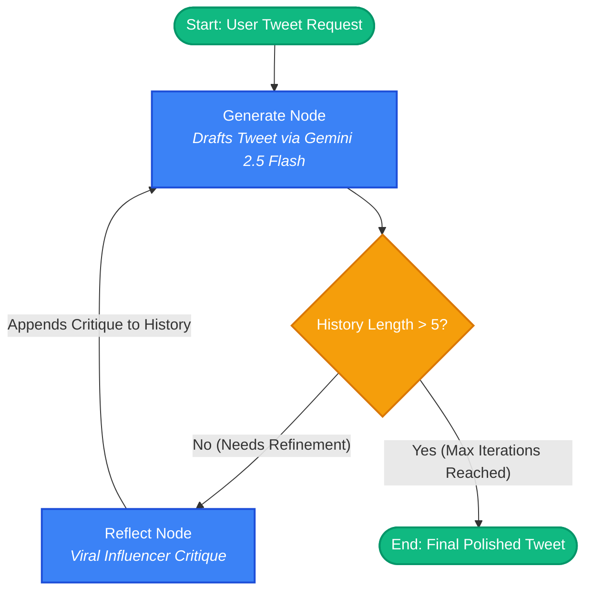
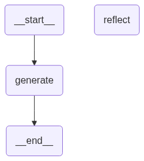

# 🔁 LangGraph Reflection Agent

An agentic workflow built with **LangGraph**, **LangChain**, and **Google Gemini** that implements the **Reflection Pattern** — where an AI generator drafts content, an influencer critic agent provides targeted feedback, and the generator iteratively refines the post until it reaches peak virality.

---

## 📌 Architecture & Workflow

The **Reflection Pattern** mimics the human drafting and review loop:





### The Iteration Cycle
1. **Generator Node (`generate`)**: An AI acting as a tech influencer writes an initial tweet based on the user's prompt.
2. **Conditional Edge (`should_continue`)**: Checks if the message history exceeds the iteration limit (`len(history) > 5`). If yes, the process completes (`END`).
3. **Reflector Node (`reflect`)**: A viral Twitter influencer agent critiques the draft on hooks, length, engagement, hashtags, and virality.
4. **Iterative Refinement**: The critique is appended back into the message history (`HumanMessage`), prompting the Generator to revise and improve in the next cycle.

---

## 🛠️ Project Structure

```text
langgraph_reflection_agent/
├── chains.py          # Generator & Reflection prompt templates + Gemini LLM chains
├── main.py            # LangGraph StateGraph, nodes, conditional edges & execution
├── graph.png          # Visual export of the compiled LangGraph workflow
├── pyproject.toml     # Poetry dependencies & project metadata
└── README.md          # Project documentation
```

---

## 📚 Study Notes & Quick Reference (For Future Learning)

### 1. Setup & Initialization
```bash
poetry init
```

### 2. `chains.py` Breakdown
- **`ChatPromptTemplate`** => The prompt instructions
- **`MessagesPlaceholder`** => Empty space / placeholder to save and inject chat history
- **`from_messages`** => Structured dialog format (what the system/AI gives and what the human gives)
- **Model**: `llm = ChatGoogleGenerativeAI(model="gemini-2.5-flash")` (or `gemini-1.5-flash`)
- **Chains**:
  ```python
  generation_chain = generation_prompt | llm
  reflection_chain = reflection_prompt | llm
  ```

### 3. `main.py` Breakdown
- **`from typing import TypedDict, Annotated`**:
  - `TypedDict` -> Gives dictionary structure
  - `Annotated` -> Attaches metadata to types
- **`BaseMessage`**: The common parent / general message type in LangChain (`HumanMessage`, `AIMessage`, etc.)
- **`add_messages`**: Reducer function that appends new messages to state instead of overwriting!
  > **This is very important in LangGraph:** It adds new messages to the existing messages list.
  ```python
  class Messagegraph(TypedDict):
      history: Annotated[list[BaseMessage], add_messages]
  ```

### 4. 🧠 FYI: Agentic AI Mental Model (Wiki)

```text
LLM
 ↓
The brain

Prompt
 ↓
Instructions for the brain

Chain
 ↓
Prompt + LLM connected together

Tool
 ↓
Something the AI can use/do

Agent
 ↓
AI decides which tools/actions to use

LangGraph
 ↓
Controls a complex workflow/loop

Reflection
 ↓
Generate → Review → Improve
```

---

## 🚀 Getting Started

### Prerequisites
- Python **3.12+**
- [Poetry](https://python-poetry.org/) package manager
- Google Gemini API Key ([Get one from Google AI Studio](https://aistudio.google.com/))

### 1. Installation
Clone the repository and install dependencies with Poetry:

```bash
git clone https://github.com/DineshRocky07/langgraph-learning.git
cd langgraph-learning/langgraph_reflection_agent
poetry install
```

### 2. Environment Setup
Create a `.env` file in the project root:

```env
GOOGLE_API_KEY="your-google-gemini-api-key"
```

### 3. Run the Agent

```bash
poetry run python main.py
```

---

## 📜 License

This project is licensed under the MIT License. Created as part of the LangGraph Learning series by [@DineshRocky07](https://github.com/DineshRocky07).
